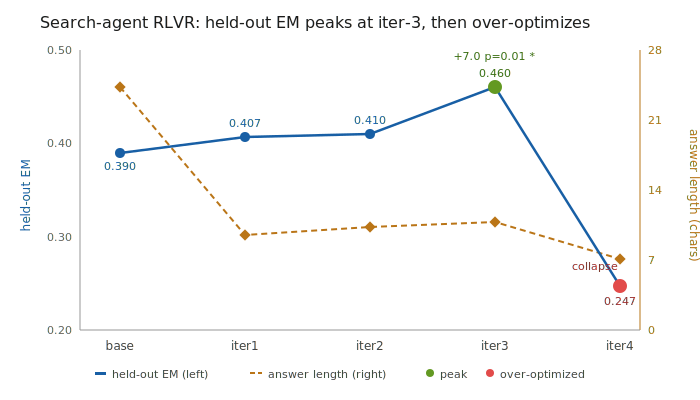

# Search-Agent RLVR — training a multi-turn retrieval agent with verifiable-reward RL

A **from-scratch GRPO** reinforcement-learning stack that trains a multi-turn **retrieval
agent** (`<search>` → BM25 over a HotpotQA corpus → `<answer>`) with a **verifiable
reward** (exact-match / token-F1). Trainer, on-policy rollout + evaluation harness, reward
design, and diagnostics — all my own, on top of vLLM + QLoRA. No veRL, no TRL.

> This is the **controlled-environment RL-science leg** of a two-repo project: the deterministic
> reward isolates measurement noise, so RL failure modes (reward over-optimization) can be studied
> mechanistically. The hard-environment headline — a noisy multi-turn tool-calling agent where
> three RL nulls were diagnosed as gradient starvation and flipped into pass^1 **0.20 → 0.41 →
> 0.55** via teacher-distillation warm-start + GRPO — lives in the companion repo
> [**tau2-agentic-rl**](https://github.com/yuyu0529nya/tau2-agentic-rl).

## Headline
- **Held-out Exact-Match 38.7% → 49.3% (+10.7 points)** — McNemar **p < 0.001** (n = 300),
  reconfirmed with multi-trial evaluation at **n = 2400, p < 1e-30**.
  A large, statistically decisive gain, re-verifiable from the raw rollouts.
- On GSM8K (same self-built loop, exact-match reward): **61.4% → 67.4% pass@1**
  (+6.0 pts, McNemar p < 0.001, n = 1319).

## The interesting part — a full diagnose → fix → improve loop
1. **Reward over-optimization (Goodhart).** A binary exact-match reward is gamed by the
   policy collapsing answers from ~24 to ~7 characters — high reward, degenerate behavior.
2. **Fix the reward.** Redesigning it as **token-F1 partial credit** raises the ceiling
   *and* stabilizes training.
3. **Controlled 3-way comparison.** Head-to-head of three anti-over-optimization levers —
   **KL-to-base anchor vs. dense process reward vs. length-aware advantage (÷√L)** — the
   mechanism-targeted **length-aware advantage wins**, removing the late-training collapse.

## The over-optimization curve

*The binary-reward run: held-out Exact-Match climbs from base 0.390 to 0.460 (p = 0.01),
then **collapses** as the policy over-optimizes the metric (answers shrink to ~7 chars).
This is exactly the failure the token-F1 + length-aware-advantage fixes remove.*
Detailed round-by-round results (binary → F1 → KL / process-reward / LATA ablation, plus the
multi-trial nail-down) are in [`reports/search_agent_rlvr_findings.md`](reports/search_agent_rlvr_findings.md).

## What's in the trainer (`scripts/grpo/`)
- **`grpo_update.py`** — GRPO from scratch: group-relative advantage `(r − mean)/(std + ε)`,
  **outcome-variance advantage gating** (drop no-contrast groups), **length-aware advantage**,
  QLoRA, batched loss, optional KL-to-base anchor.
- **`search_agent.py` / `search_retriever.py` / `qa_reward.py`** — the retrieval-agent
  episode loop, a pure-stdlib BM25 retriever over HotpotQA, and the verifiable QA reward
  (normalized EM + token-F1).
- **`run_search_agent.sh`** — end-to-end: serve → base eval → N-iter on-policy
  collect+update → eval → analyze.
- **`gsm8k_collect.py` / `gsm8k_eval.py` / `run_gsm8k.sh`** — the GSM8K RLVR pipeline.
- **`analyze_search_eval.py` / `summarize_eval.py` / `recheck_search_em.py`** — paired
  evaluation with bootstrap CIs + McNemar, behavioral (answer-length) diffs, and an
  independent re-check of EM straight from the raw rollouts.

## Tech
Qwen2.5 (1.5B / 7B) · vLLM · PEFT / QLoRA · bitsandbytes · transformers · HotpotQA ·
on-policy GRPO with verifiable rewards (RLVR).

*Trained adapters, model weights, and rollout/eval artifacts are kept out of the repo for
size — this repository is the code and the findings write-ups (`reports/`).*
